#  AniBridge

The smart way to keep your anime lists perfectly synchronized.

  

> [!IMPORTANT]
> Visit the [AniBridge documentation](https://anibridge.eliasbenb.dev) for detailed setup instructions and usage information.

[Docker Setup](https://anibridge.eliasbenb.dev/getting-started/docker.md) | [Source Setup](https://anibridge.eliasbenb.dev/getting-started/source.md) | [Configuration](https://anibridge.eliasbenb.dev/configuration.md)

## Key Features

- **🔄 Comprehensive Synchronization**: Automatically synchronizes watch status, progress, ratings, reviews, and start/completion dates between your anime library and list.
- **🎯 Smart Content Matching**: Uses a [curated mappings database](https://github.com/anibridge/anibridge-mappings) with fuzzy title search fallback and support for custom mapping overrides.
- **⚡ Optimized Performance**: Intelligent batch processing, rate limiting, and caching to minimize API usage while maximizing sync speed.
- **👥 Multi-User & Multi-Profile**: Define multiple profiles with separate settings targeting different users or libraries.
- **🖥️ Web Dashboard**: Intuitive web interface with a real-time sync timeline, profile management, custom mapping editor, and log viewer.
- **🛡️ Safe & Reliable**: Built-in dry run mode for testing and automatic backups with restoration through the web UI for easy recovery.
- **🐳 Easy Deployment**: Docker-ready with easy YAML-based configuration.

```mermaid
flowchart LR
    User1([👤 User 1])
    User2([👤 User 2])
    User3([👤 User 3])
    Library[(📺 Media Library)]
    AniBridge[<img src='https://anibridge.eliasbenb.dev/assets/images/logo.png' /> AniBridge]
    List[(📱 Anime List)]
    Mappings[(🗺️ anibridge-mappings)]

    User1 -->|Watches episodes| Library
    User2 -->|Watches movies| Library
    User3 -->|Rates & reviews| Library

    Library -->|Watch data & ratings| AniBridge
    List -->|Current anime lists| AniBridge

    AniBridge -->|ID lookups| Mappings

    AniBridge -->|Intelligent sync| List
```

## Web UI Screenshot

_View more screenshots in the [documentation](https://anibridge.eliasbenb.dev/web/screenshots)_
