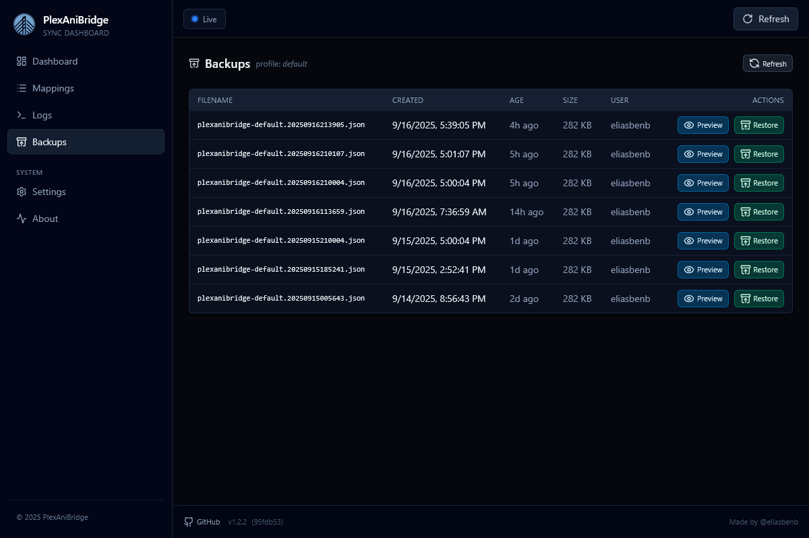

Use the backups page to browse, preview, and restore the AniList snapshots AniBridge creates for you. The page has two stops: a profile picker at `/backups` and a detailed table at `/backups/{profile}`. Everything you see reflects the real files stored in `$AB_DATA_PATH/backups`, so you always know what is available.

_Note: backups are kept for 30 days by default. Adjust [BACKUP_RETENTION_DAYS](../configuration.md#backup_retention_days) if you need a longer retention window._

The profile view lists every backup with its filename, when it was created, how old it is, file size, and which AniList user it belongs to.

Actions on each row:

- `Preview` opens the backup in a modal so you can skim the JSON of your AniList backup before doing anything permanent.
- `Restore` triggers the restore job, and shows a toast summarising how many entries were brought back plus any warnings.
