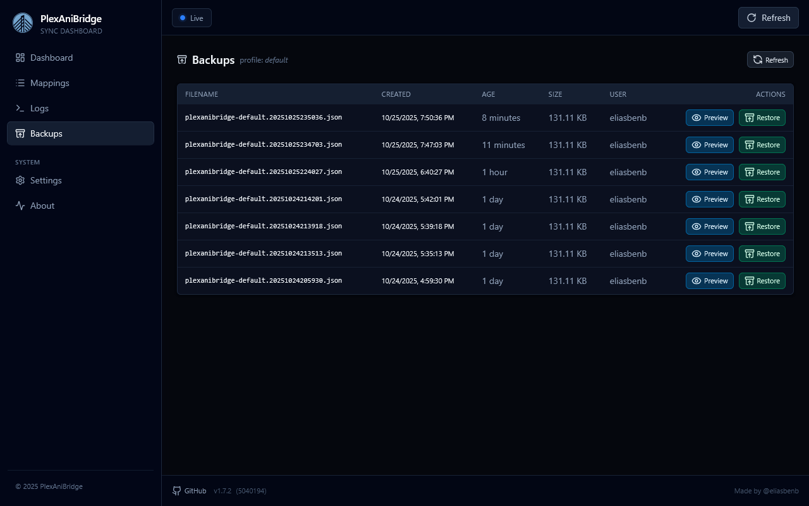

# AniList Backups

Use the backups page to browse, preview, and restore the AniList snapshots PlexAniBridge creates for you. The page has two stops: a profile picker at `/backups` and a detailed table at `/backups/{profile}`. Everything you see reflects the real files stored in `PAB_DATA_PATH/backups`, so you always know what is available.

_Note: backups are automatically deleted after 7 days (rolling retention). If you need to keep a snapshot longer, save it in a safe location._

he profile view lists every backup with its filename, when it was created, how old it is, file size, and which AniList user it belongs to.

Actions on each row:

- `Preview` opens the backup in a modal so you can skim the JSON of your AniList backup before doing anything permanent.
- `Restore` triggers the restore job, and shows a toast summarising how many entries were brought back plus any warnings.
