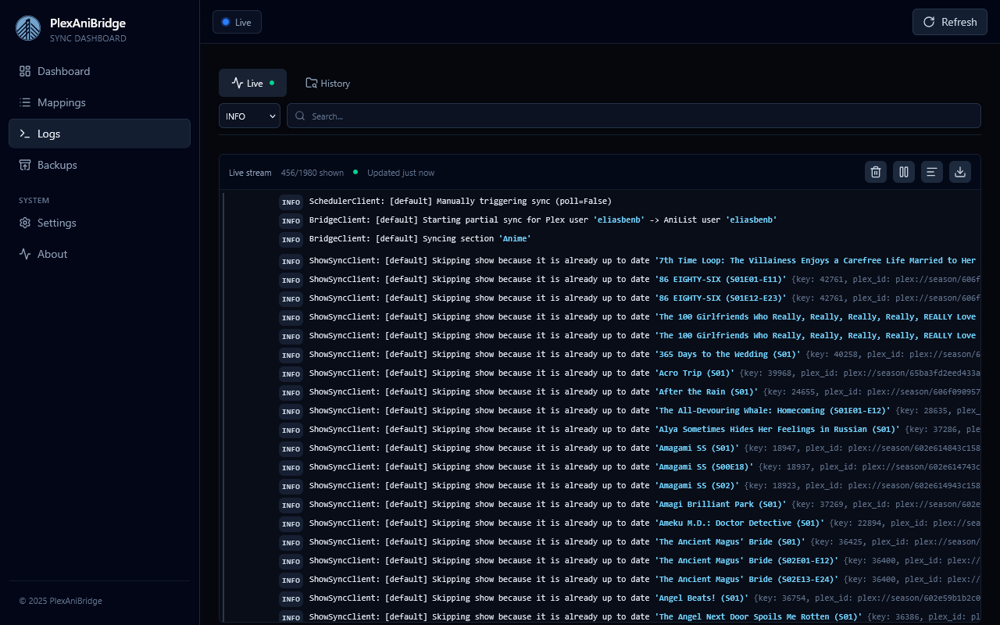

The logs page has two tabs for real-time streaming output and archived log files. It connects to `/ws/logs` for live events and `/api/logs/*` for history.

## Live Stream

- The `Live` tab subscribes to the websocket and appends new entries as they happen.
- The toolbar actions let you clear the current buffer, toggle auto-scroll, switch message wrapping, and download the in-memory log slice as a text file.

## Log History

- Switch to the `History` tab to browse archived log files stored on disk.
- Choose how many trailing lines to load (100–2000 or all).
- Wrap toggles and downloads are available here too, letting you export just the excerpt you reviewed.

## Search & Filtering

- The global search box filters both live and history buffers across message text with a case-insensitive match.
- The level selector is ranked (`DEBUG` < `INFO` < `SUCCESS` < `WARNING` < `ERROR`). Selecting a level hides anything less severe so you can focus on warnings or failures.
