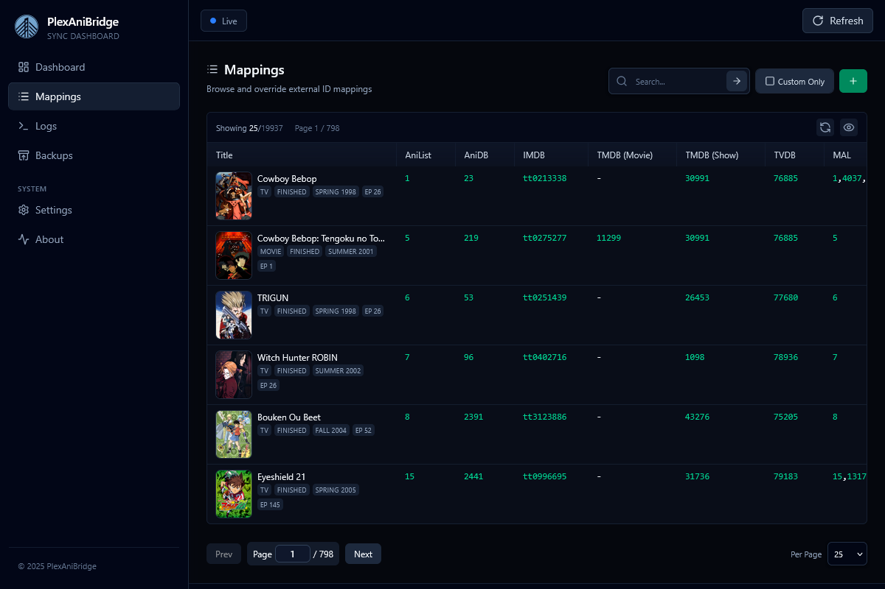

The mappings page lets you browse and manage the AniList ↔ Plex mapping database. You can search existing records with a powerful query language and manage mapping overrides.

## Searching & Filtering

- The search bar uses the [Mappings Query Language](../mappings/mappings-querying-language.md) with autocomplete hints as you type.
- Some useful queries to try: `"One Piece"`, `anilist:12345`, `tvdb:67890`, `has:tvdb_mappings`.
- Press `Enter` or click the search icon to run a query.
- Toggle `Custom Only` to limit results to entries sourced from your [custom mappings](../mappings/custom-mappings.md) (`mappings.custom.(json|yaml|yml)`)

## Table Controls

- Column visibility can be set by clicking the eye icon popover; toggles persist in local storage.
- Drag column separators to resize widths as needed; column widths persist in local storage.
- Use `Show All`, `Hide All`, or `(reset)` inside the eye icon popover to restore the default column layout.
- Pagination controls (page navigation, per page size) sit at the foot of the table.

## Editing & Creating Overrides

- `New Override` (plus icon in toolbar) opens the editor with a blank template; `Edit` in a row pre-fills fields from the current mapping.
- The override editor has two tabs: Form and Raw JSON; Form mode exposes all supported identifiers with per-field modes (`omit`, `null`, `value`) and helper controls for TMDB/TVDB season mappings.
- Switch to `Raw JSON` for a schema-backed Monaco editor that validates against the override schema. Changes sync back to the form when you return.
